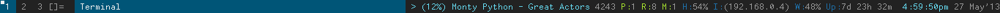

#dwm Status

I use the [dwm](http://dwm) tiling window manager. This is an extremely
lightweight, small source size window manager written entirely in C. It's
perfect for my needs, lightning fast, very small (optionally zero) window
footprint, and can be endlessly configured (literally) by editting the source
code.

It uses the root's window name to print a status bar, or any arbitary text,
which makes it very flexible since and output from any command can be used as
the status bar contents. This script uses a number of functions to output some
useful info which then gets piped to the window name and displayed at the status
bar.

Currently it displays:

- Currently playing song from mpd (along with pause/play state and
progress percentage)
- Number of open system files (playing around with some commands -
why not?).
- Number of updates to system packages with `pacman`.
- Number of unread feed items from `Rawdog` (see <a
		href="">here</a> for my setup and <a href="">here</a> for more
details).
- Currently used percentage on the main `/root`
partition.
- I.P. address of the current web connection.
- The signal strength of the current wifi connection.
- The uptime of the machine.
- And the current date and time.

The script writes all of these details to files in the `/tmp/dwm_status_bar/`
directory and then collates them together into a single file which is used as
the root window's name.

There is also the ability to call this as a standalone script and so update all
info immediately. This is done with the `now` flag.

*Note* - I use the `statuscolors` patch to add some colour to the
status bar. This involves sending escaped colour sequence characters in the text
which are interpretted to set the colour of the subsequent text. If you don't
use that patch, simply remove all the strings that look like "`\x01`"
and the script will work fine.

<a href="dwmstatus.png"></img></a>

<a href="https://github.com/jaw42/bin/blob/master/dwmstatus">
<i class="icon-cloud-download"> </i> Download</a>
